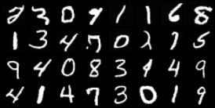

# TinyDiffusion

[](https://github.com/HilthonTT/TinyDiffusion/actions/workflows/ci.yml)
[](https://www.python.org/downloads/)
[](https://github.com/astral-sh/ruff)
[](LICENSE)

A PyTorch implementation of a diffusion model for image generation: a DDPM
U-Net trained on MNIST, sampled with DDIM.



*`contents/sample_0006.png`, written automatically after the sixth epoch. The
top half is generated, the bottom half is real MNIST — every grid pairs them so
stroke weight and contrast are directly comparable. Six epochs is about 11
minutes on an RTX 5060; most digits are already well formed, a few strokes are
still breaking up.*

> **Status:** early development. Training and sampling work end to end on
> MNIST; other datasets are not wired up yet.

## Quickstart

Requires Python 3.14 and [uv](https://docs.astral.sh/uv/).

```bash
uv sync --all-extras --dev              # creates .venv/ (~0.7 GB)
./run.sh train  --config configs/smoke.toml
./run.sh sample --checkpoint runs/smoke/checkpoints/last.pt --out runs/smoke/gen.png
```

On Windows use `.\run.ps1` in place of `./run.sh`. The wrappers find an
interpreter that has the package installed and forward the rest to the CLI —
`python src/tinydiffusion/cli.py` does not work in a `src/` layout.

`configs/smoke.toml` is a deliberately tiny run for checking the pipeline
end to end (~28 s per epoch on an RTX 5060, ~3.5 min on a CPU). The real run is
`configs/mnist.toml`:

```bash
./run.sh train --config configs/mnist.toml
```

MNIST (63 MB) downloads itself on first use. Each epoch writes a sample grid —
generated digits above real ones — and a resumable checkpoint. Afterwards,
`sample` generates images from any checkpoint and `eval` scores it on the
held-out test split:

```bash
./run.sh sample --checkpoint checkpoints/last.pt --num-images 16
./run.sh eval   --checkpoint checkpoints/last.pt
```

**Using a GPU:** it is automatic when a CUDA-capable torch is installed, and
falls back to the CPU when not. On Windows the default wheel is CPU-only, so
getting the GPU takes one extra install step. See
**[USAGE.md](USAGE.md)** for that, along with configuration, disk and download
sizes, and troubleshooting.

## Documentation

| | |
| --- | --- |
| [USAGE.md](USAGE.md) | Install, GPU setup, downloads and disk use, training, sampling, evaluation, every CLI flag, config reference, troubleshooting |
| [CONTRIBUTING.md](CONTRIBUTING.md) | Development workflow |
| [CHANGELOG.md](CHANGELOG.md) | Release history |

## How it works

- **Forward process** — `diffusion/schedules.py` builds the beta schedule
  (cosine by default) and every coefficient derived from it; `diffusion/ddpm.py`
  noises an image to a random timestep and scores the network's noise estimate.
- **Backbone** — `models/unet.py` is the DDPM U-Net: pre-activation ResBlocks
  with FiLM time conditioning at every resolution, self-attention at chosen
  scales, and a spatial bottleneck.
- **Sampling** — `diffusion/ddim.py` runs the reverse chain over a subsequence
  of timesteps, so 50 steps stand in for 1000. `eta` interpolates between
  deterministic DDIM and ancestral DDPM.
- **Weight averaging** — `training/ema.py`. DDPM's published sample quality
  depends on it, so training and sampling both draw from the EMA weights.

## Development

See [CONTRIBUTING.md](CONTRIBUTING.md) for the full workflow. Quick version:

```bash
uv run pre-commit install
uv run pytest
uv run ruff check . && uv run ruff format --check .
uv run mypy
```

## License

[MIT](LICENSE)
