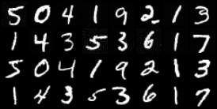

# TinyDiffusion

[](https://github.com/HilthonTT/TinyDiffusion/actions/workflows/ci.yml)
[](https://www.python.org/downloads/)
[](https://github.com/astral-sh/ruff)
[](LICENSE)

A PyTorch implementation of a diffusion model for image generation: a DDPM
U-Net trained on MNIST, sampled with DDIM, and conditioned on the digit class
with classifier-free guidance — so you can ask it for a 7.



_`docs/sample_0010.png`, written automatically at the end of the tenth epoch.
The top half is generated, the bottom half is real MNIST — every grid pairs
them so stroke weight and contrast are directly comparable. Most digits are
already well formed; a few strokes are still breaking up._

> **Status:** early development. Training and sampling work end to end. MNIST
> is the default and the best-exercised path; Fashion-MNIST and CIFAR-10 are
> wired up through the same registry (`dataset = "cifar10"`, and see
> `configs/cifar10.toml`) but have had far less mileage.

## Quickstart

Requires Python 3.14 and [uv](https://docs.astral.sh/uv/).

```bash
uv sync --all-extras --dev              # creates .venv/ (~3.5 GB with CUDA)
./scripts/run.sh train  --config configs/smoke.toml
./scripts/run.sh sample --checkpoint runs/smoke/checkpoints/last.pt --out runs/smoke/gen.png
```

On Windows use `.\scripts\run.ps1` in place of `./scripts/run.sh`. The wrappers
find an interpreter that has the package installed and forward the rest to the
CLI — `python src/tinydiffusion/cli.py` does not work in a `src/` layout.

`configs/smoke.toml` is a deliberately tiny run for checking the pipeline end to
end (~28 s per epoch on an RTX 5060, ~3.5 min on a CPU). The real run is
`configs/mnist.toml`, which trains conditionally on the ten digits:

```bash
./scripts/run.sh train  --config configs/mnist.toml
./scripts/run.sh sample --checkpoint checkpoints/last.pt --labels 7 --guidance 4
```

MNIST (63 MB) downloads itself on first use. Each epoch writes a sample grid —
generated digits above real ones — and a resumable checkpoint.

### Your own images

`dataset = "folder"` trains on a directory instead of a download — either loose
images, or one subdirectory per class:

```bash
./scripts/run.sh train --config configs/folder.toml --set data_root=photos
```

Everything is resized and centre-cropped to `image_size`, so the images need
not be square or uniform, and a slice is held back automatically for
validation. See
[Training on your own images](docs/usage/configuration.md#training-on-your-own-images).

Any config field can be overridden from the command line with `--set`, which is
what turns a sweep into a shell loop:

```bash
./scripts/run.sh train --config configs/mnist.toml --set lr=1e-4 --set batch_size=64
```

**Using a GPU:** `uv sync` installs a CUDA build of PyTorch on Windows and
Linux, so an NVIDIA GPU is picked up automatically, and training falls back to
the CPU when none is visible — its first line says which it chose. Add
`--no-sources` for a CPU-only environment. For scale, one MNIST epoch is about
1.8 minutes on an RTX 5060 and 29 on a CPU. See
[docs/INSTALL.md](docs/INSTALL.md) for verification and troubleshooting.

## Commands

Every command takes `--help`, and [USAGE.md](USAGE.md) documents each flag in
full.

| Command | What it does |
| --- | --- |
| [`train`](docs/usage/training.md#training) | Trains from a config, checkpointing and sampling each epoch |
| [`sample`](docs/usage/sampling.md#sampling) | Generates images from a checkpoint — `--labels`, `--guidance`, `--sampler`, `--steps` |
| [`eval`](docs/usage/evaluation.md#evaluating-a-checkpoint) | Scores a checkpoint's loss on the held-out test split |
| [`fid`](docs/usage/evaluation.md#measuring-sample-quality) | Measures sample *quality* against real images, with `--kid` and `--precision-recall` |
| [`tui`](docs/usage/training.md#the-dashboard) | Trains inside a terminal dashboard — live loss charts, ETA, sample grids |
| [`plot`](docs/usage/metrics.md#plotting-a-run) | Draws a run's `metrics.jsonl` as a figure, or several runs on shared axes |
| [`interpolate`](docs/usage/sampling.md#walking-between-two-latents) | Samples every point on a walk between two latents |
| [`serve`](docs/usage/serving.md#serving-a-checkpoint-over-http) | Puts a checkpoint behind a JSON API |

Three that are worth a sentence each:

- **`fid`** caches the real images' half of the score under `data/fid_cache` —
  it does not depend on the checkpoint, which is what makes sweeping
  `--guidance` or `--steps` affordable. FID needs ~10,000 images to mean
  anything; `--kid` is unbiased, so a score over 2,000 means what one over
  50,000 does, and `--precision-recall` splits a bad score into its two causes.
- **`tui`** starts with `s`, stops at a batch boundary and checkpoints with `x`,
  and lists every key under `?`. Needs the `tui` extra.
- **`interpolate`** says something a grid of samples cannot: whether the space
  *between* two images is populated, or whether the model snaps from one mode
  to another with nothing in between.

## Documentation

| | |
| --- | --- |
| [docs/INSTALL.md](docs/INSTALL.md) | Install, GPU setup, verification, troubleshooting |
| [USAGE.md](USAGE.md) | Index of the usage pages: installing, training, sampling, evaluation, serving, every CLI flag and config field |
| [docs/ARCHITECTURE.md](docs/ARCHITECTURE.md) | How the model and the codebase are put together |
| [RESULTS.md](RESULTS.md) | Measured scores, with the commands and hardware that produced them |
| [CONTRIBUTING.md](CONTRIBUTING.md) | Development workflow |
| [CHANGELOG.md](CHANGELOG.md) | Release history |

## Development

See [CONTRIBUTING.md](CONTRIBUTING.md) for the full workflow. Quick version:

```bash
uv run pre-commit install
uv run pytest
uv run ruff check . && uv run ruff format --check .
uv run mypy
```

## License

[MIT](LICENSE)
